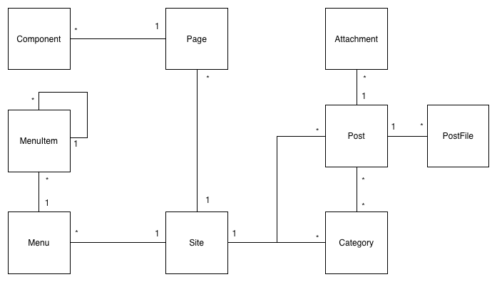

# [Architecture](architecture.md)

FenixEdu Pages is composed mainly of one single module, FenixEdu CMS. In fact Pages contains only the parts that allow CMS to run as standalone application. As such, the architecture of Pages is in fact mostly the architecture of FenixEdu CMS that we explain next.

Originally it was designed as a replacement for the public pages when FenixEdu split into Academic and Learning. As such, the entire module is quite bare bones but designed to be easily expanded into the needs of any application that requires it. The core model was design having as basis popular blogging tools like Drupal and WordPress. The reasoning behind this was that those tools can adapt to almost any use case by virtue of being endlessly pluggable.

FenixEdu CMS domain model splits content and theming. This separation allows that content to be independent of presentation, pushing the burden of how content for each type of site to the theme that implementes it. 
Content is persisted as the diagram that follows:

**Site** represents the logical separation of content between each possible site. Each **Site** instance contains a slug that represents the path to that site. Inside each site, a Page represents an possible url, that should appear when a user visits this url. This is done by adding **Components** to a **Page**. A **Component** works a bit like a regular Controller/Action, it looks into the request and puts information on a context that will be used by the theme.

Also, a **Site** has **Menus**. These are hierarchical organisation of pages and is mostly used to show a menu on a page. User content is stored as **Posts**. Each **Post** contains a title and a body and can be categorised by attaching **Categories** to the a Post. These are unique to each site and are ontological sets of posts.

**Posts** can have images or other content files that are referenced on the body called **PostFiles**. The user can also attach files to a post to be shown as related material for that post. These are **Attachments**. 

