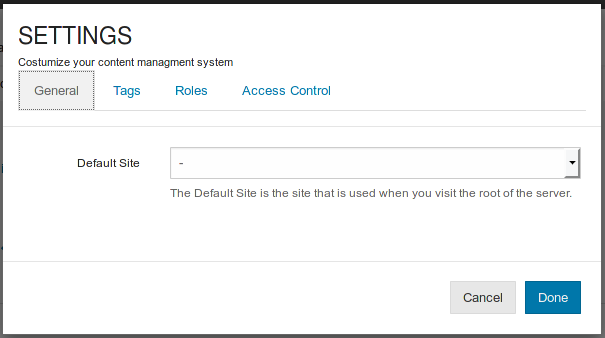
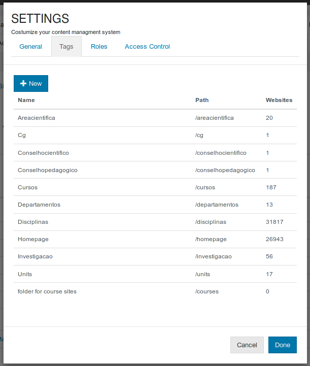
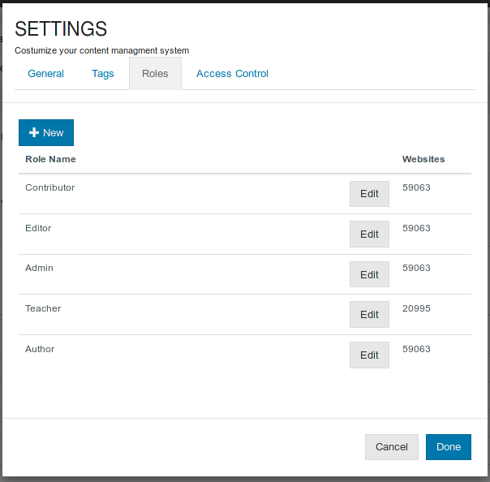

# [CMS Configurations](cms-configuration.md)

Via the wrench icon on the main CMS interface is possible to access and edit several system wide properties.

### **Default Site**

This is the site served when viewing the root of the server.

### **Tags**

These tags act more like folders to organize your sites, as each site can only have one and the folder path will be part of the site url.

The interface only allows to create a new tags.

### **Roles**

This list contains the role templates that each site can use to create roles. Each role has an associated set of permissions.

It is possible to create new roles or edit existing ones, in both cases it is necessary to select the permissions each role template list.

This interface is also available on /cms/permissions.

### **Access Control**

It is possible to control who has access to these global settings using bennu groups, via the access control interface

