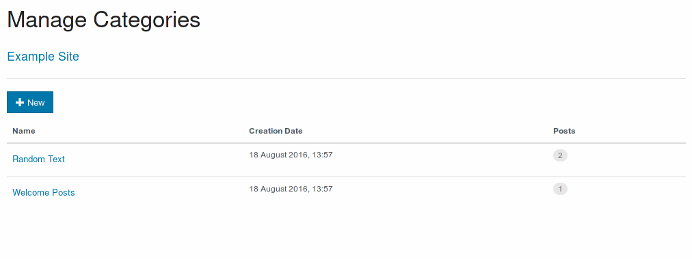

# [Categories](./categories.md)

Categories allow to group posts with similar content or themes. These groups are later used to show filtered lists of posts.

Choosing one category will show the details and all posts with that category.

It is also possible to set a category as priviledged, so that only users with adequate permissions can use them.

