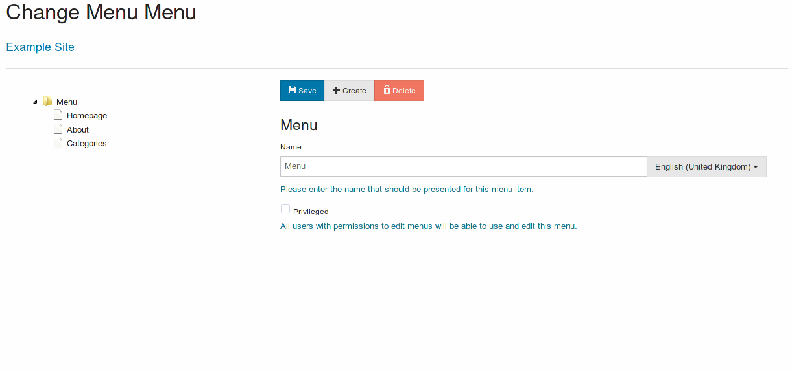

# [Menus](./menus.md)

Menus allow to organize content, and select the order of appearance of menu items on the site.

Menu items can be links to a site page, an external url or a sub-folder. By dragging items and pressing save is possible to control the display order.

Menu items can also be set to privileged, allowing for some menus that can only be controlled by users with adequate permissions.

