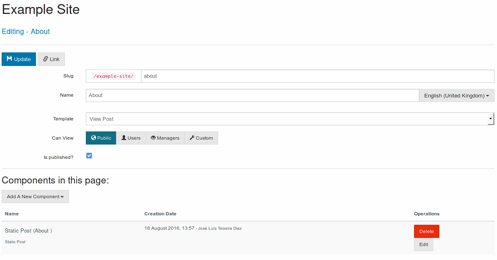

# [Advanced Page Management](./advanced-page-management.md)

The advanced page management allows to create custom pages with content other than simple posts.

This interface allows to select the template used to view the page and to select one or more components that will be shown.

A [components](../components/components.md) allows to select the content that is going to be present in the page, for example to select a specific post or a list of categories.

