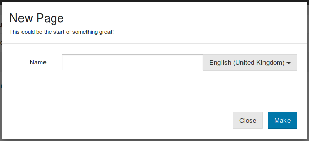
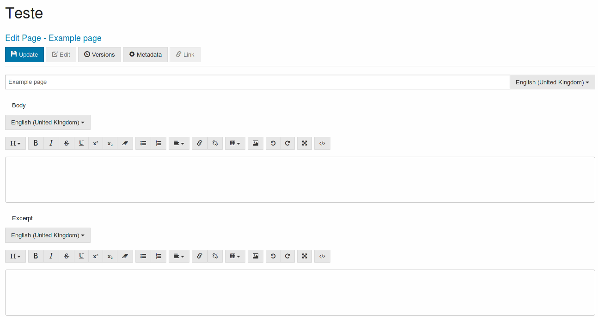
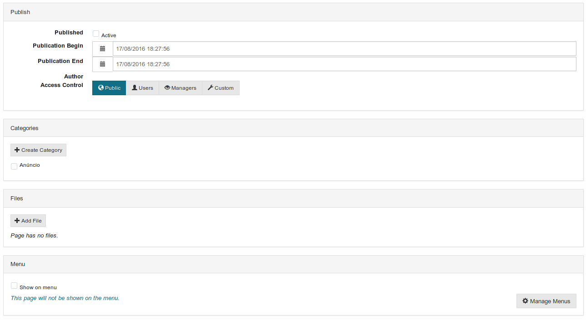

# [Pages](./pages.md)

There are two different modes to edit pages.

+ A basic interface where the page only contains a single static post, and is possible to edit the post content directly
+ An advanced interface where it is possible to set the page components, for example to a list of posts.

Only pages that contain a single static post will be shown, when viewing the simplified list.

## Create new page

On the page management interface press the "New" button, or the site management interface press the "New" button, and select "Page".

Fill the form with the new page name and press "Make".

When the page is created you will be redirected to the edit pages interface.

## Edit Page

Each page has three content fields, the title, the body and the excerpt, with all being editable.

The page excerpt is a small text to be shown in a list view of the site pages, so it should be only a small description of the page contents.

### **Versions**

It is possible to compare the page with previous page versions, and also revert to a previous one.

There are also other panels related to the site organization and publishing the page.

### **Publish**

For a page to be visible it has to be marked as published.

It is also possible to mark the page be automatically published at a later date, also it is possible to set the publication end to a later date.

Lastly is also possible edit who can see the page, for example to be viewable by everyone.

### **Categories**

Each page can have a different [category](../categories/categories.md), these can be used to filter pages and posts when creating lists.

### **Menu**

It is possible to have a page be shown in the site [menu](../menus/menus.md), by activating the corresponding option.

