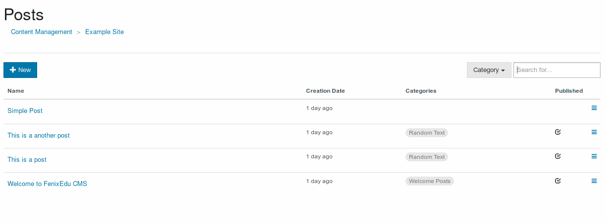

# [Posts](./posts.md)

A post is composed by a title, a body and a small excerpt to be used in compact views.

Posts
Páginas… Manage site
Pular para o fim do banner
Ir para o começo do banner
Ir directamente para o fim dos matadados
Criado por goncalo.sousa, última alteração em ago 19, 2016Ir directamente para o início dos matadados
A post is composed by a title, a body and a small excerpt to be used in compact views.

## Create Post
To create a new post either press the "New" button and choose "Post" on the main site management interface or press "New" on the post list.

## Edit Post
It is possible to edit the title, body and excerpt of any post. It is also possible to revert to a previous version or set the published status of a post.

### **Versions**
Posts store previous editions using a versions, it is possible to check the contents of a previous version or revert to a specific version.

### **Publish**
It is possible to control the visibility and published status of a post, including setting the post to be automatically visible after a specific date.

### **Categories**
[Categories](../categories/caCategoriestegories.md) can be assigned to posts, and can be used group posts with the same type of content, for example announcements, or tutorials.