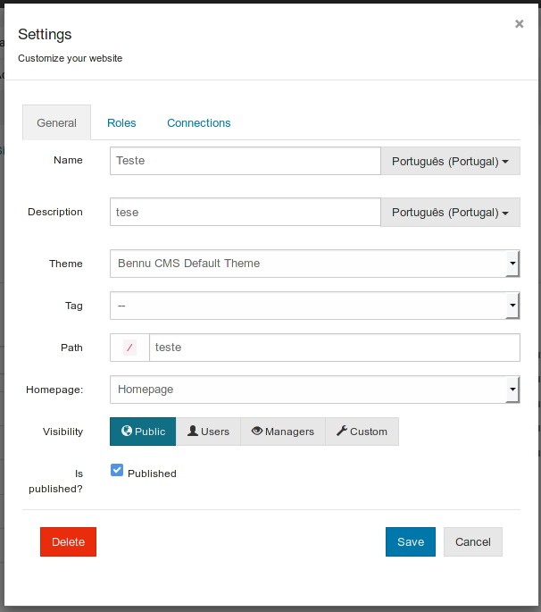
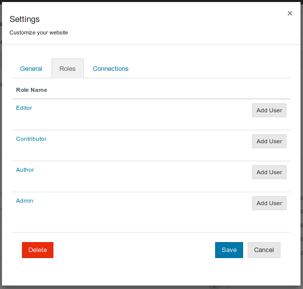
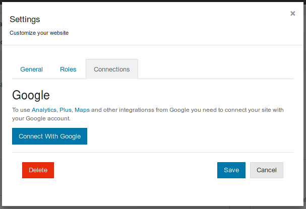

# [Site properties](site-properties.md)

Via the wrench icon it is possible to change most of the site configurations.

### **Properties**

Besides the site name and description, the first tab allows to edit the site theme, tag, path, homepage, visibility and also set the site as published.

The path will be the link to your site, so this must be unique on your application.

The homepage is the page of your site that will be served when visiting your site.

Sites need to be published in order to view its pages.

### **Roles**

Roles control the permissions of users to edit and manage the site contents.

In this interface it's only possible to add new users to an already existing role.

To change the permissions of a role in your site, click on the role that you want to edit.

### **External connections**

The CMS also allows to connect your site with external services, for example the Google Analytics in order to obtain viewership statistics.

