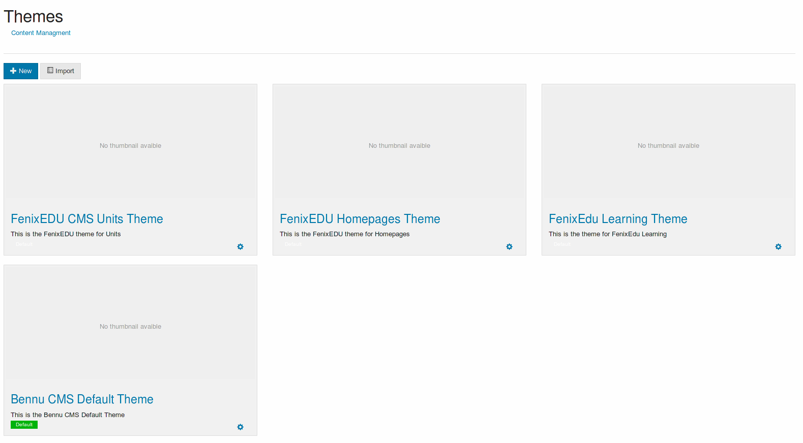

# [Themes](./themes.md)

The theme interface lists all the available themes, with links to [manage each theme](edit).

It is also possible to create a new theme or importing an existing one, via the "New" button.

Themes can also inherit from existing themes. This allows for a simpler theme development with only changes present in the new theme.

